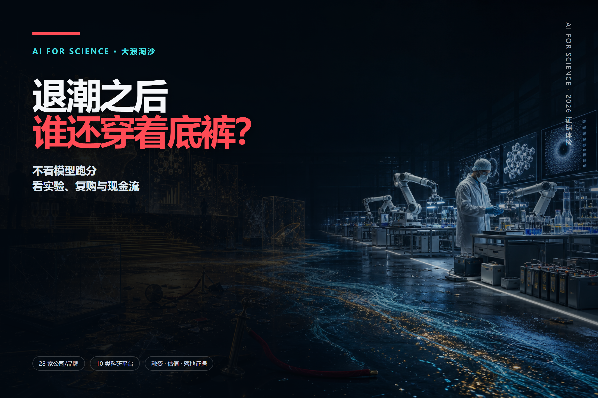
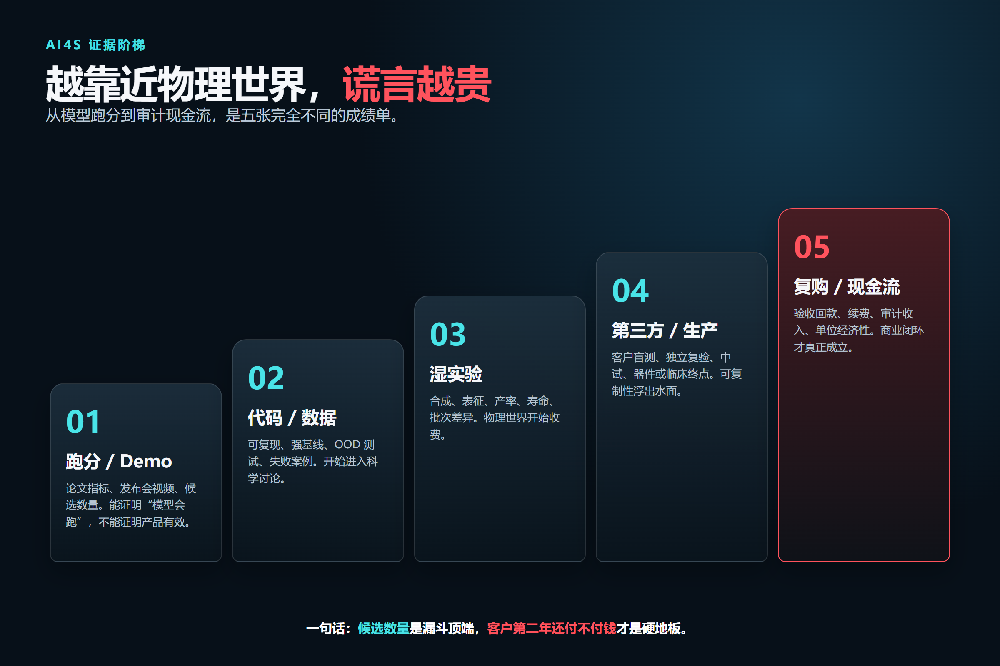
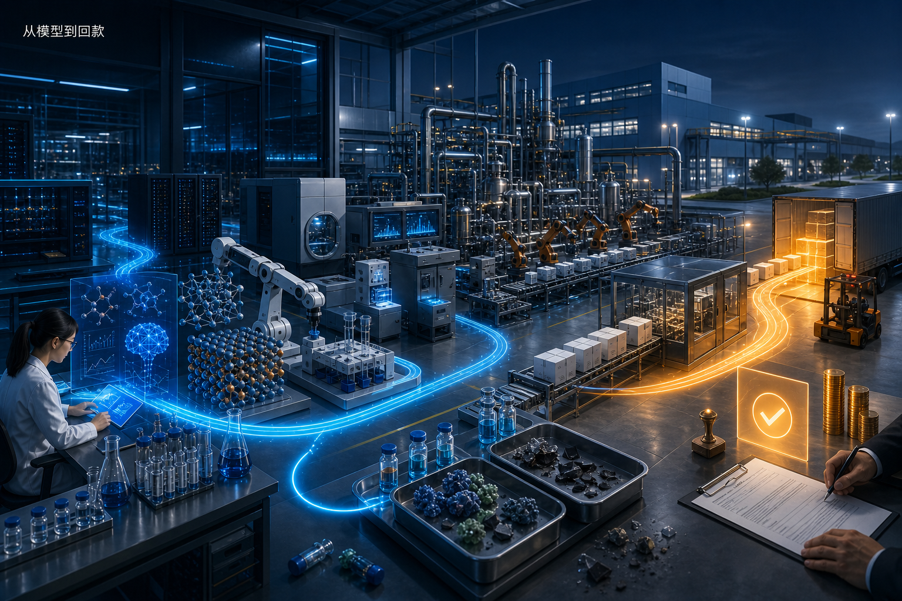
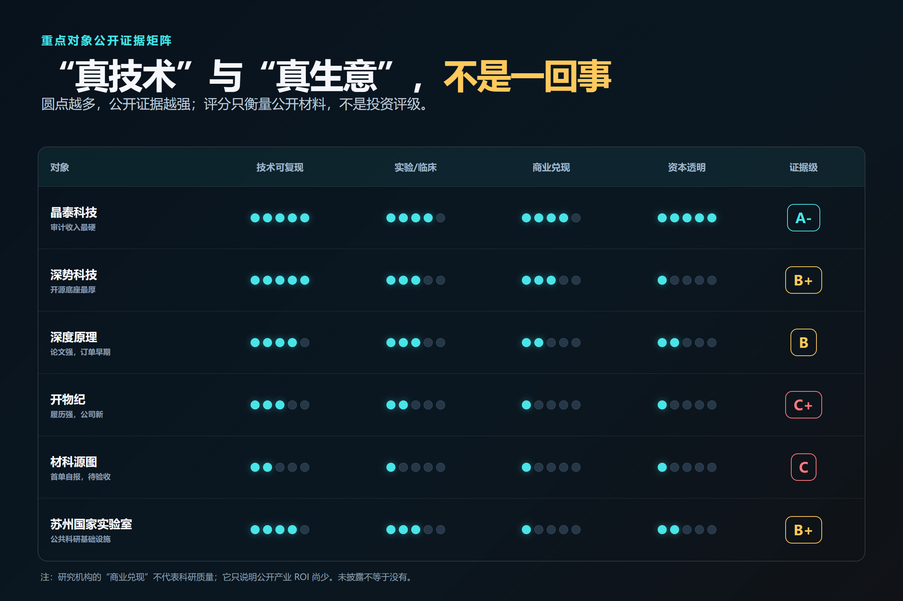
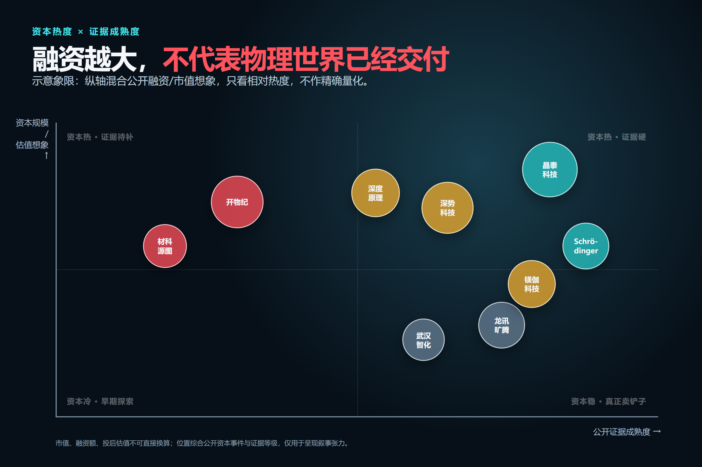
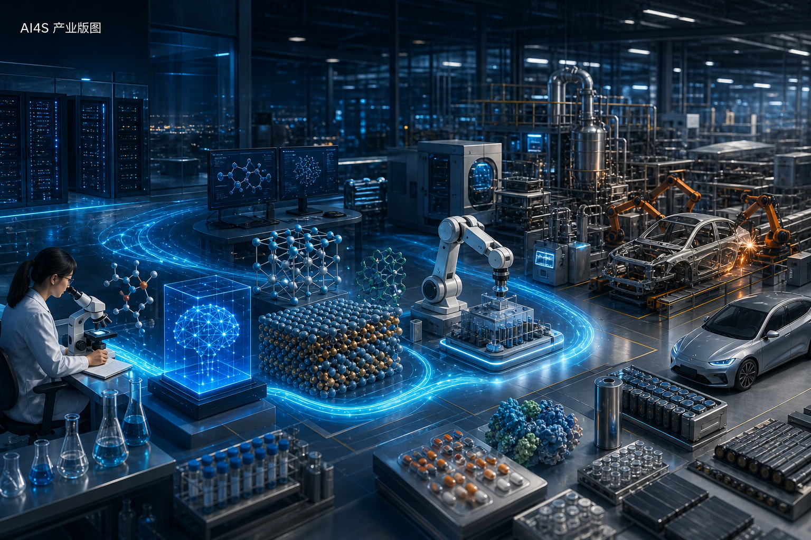
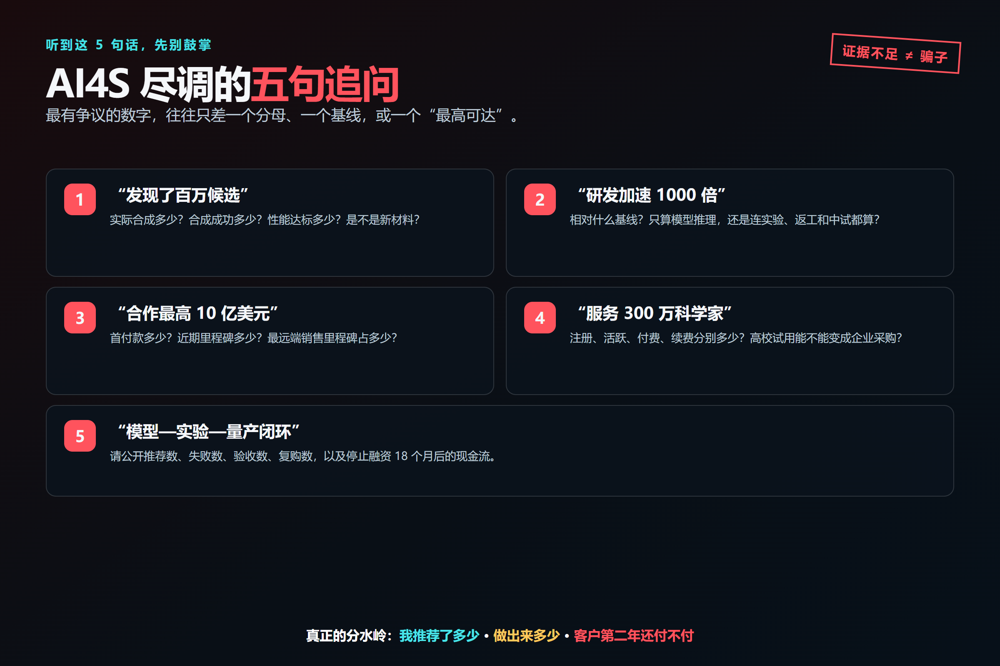
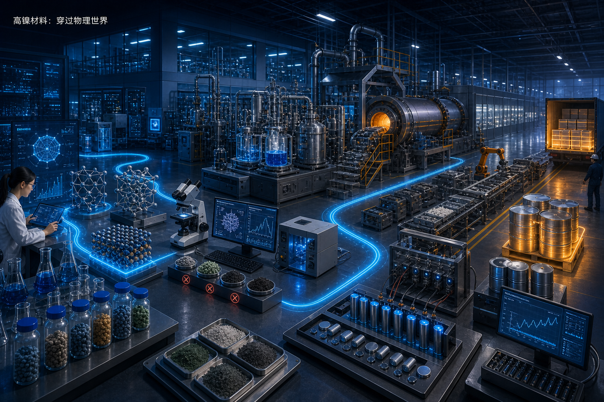

# AI4S 退潮：谁在造材料，谁在造估值？

> **研究截止：2026 年 8 月 18 日**  
> **样本：28 家/品牌与 10 类科研平台；重点深拆 6 个用户点名对象**  
> **一句话结论：AI for Science 不是庞氏骗局，但它的融资叙事里，确实可能长出“用下一轮融资证明上一轮技术价值”的庞氏式增长逻辑。**

## 先给答案：AI4S 已经落地，但远没有普遍跑通

AI4S 最容易造成错觉的地方，是把四件完全不同的事揉成一句话：

1. 模型在公开数据集上跑得更快；
2. 模型给出了一个计算候选；
3. 实验室做出了样品；
4. 客户愿意持续付钱，产品还能规模化生产。

从 1 到 4，每跨一级，都可能死掉 90% 的故事。

今天已经可以确认的真落地包括：AlphaFold 的超大规模结构数据库、Schrödinger 多年续费的软件业务、晶泰科技的审计收入、微软与 PNNL 做出的电池原型、深势/DeepModeling 的开源原子模拟工具链，以及中科大“机器化学家”的真实实验闭环。这些都不是 PPT。

但“发现百万候选”“缩短一千倍”“合作金额最高十亿美元”，都不等于做出了可量产产品，更不等于形成十亿美元收入。AI4S 最大的泡沫，不在算法本身，而在**把计算速度当研发成功率、把合作上限当收入、把融资额当估值、把平台用户当付费客户**。

### 本报告怎么判“真”

我们把证据拆成四个维度，而不是简单站队：

- **技术证据**：论文、代码、数据、强基线、分布外测试能否复现；
- **实验/临床证据**：有没有合成、表征、器件、产率、寿命或临床终点；
- **商业证据**：有没有订单、验收、复购、审计收入，而不只是合作签约；
- **透明度**：客户身份、样本数、失败率、收入结构、现金消耗是否披露。

证据等级不是投资评级：

| 等级 | 含义 | 典型证据 |
|---|---|---|
| A | 已有硬落地 | 审计收入/持续续约/临床或第三方实物验证 |
| B | 真技术、早转化 | 论文或开源扎实，已有实验/试点，但规模化与复购未证 |
| C | 早期待验证 | 团队与融资真实，关键性能、客户或收入主要为公司自报 |
| D | 欺诈证据成立 | 虚构论文/客户/融资，或法院、监管、合作方认定 |

**本次审阅没有发现足以把被点名公司列为 D 的公开证据。**因此，下文会使用“证据不足”“宣传跑在验证前”“高风险”，不会把意见分歧写成事实性欺诈指控。

## 六个重点对象：底裤厚度完全不同

### 1. 晶泰科技：商业证据最硬，估值也最敢讲故事

**判断：A-｜真商业化，但利润质量、客户集中度和估值需要打问号。**

晶泰科技是这批公司里最容易被验证的一家，因为它已经上市。公司 2025 年年报披露：收入 8.026 亿元，同比增长 201.2%；其中药物发现解决方案 5.379 亿元，AI4S 智能解决方案 2.647 亿元；全年利润 1.346 亿元，调整后净利润 2.582 亿元，研发支出 5.692 亿元。这是审计口径，远强于“签了多少战略合作”。[晶泰 2025 年年报](https://ir.xtalpi.com/media/05sd1uig/2025-annual-report.pdf)

但数字背后有三根刺：

- 第一大客户贡献 3.651 亿元，约占全年收入 **45.5%**；
- 其他净收益约 5.140 亿元，而经营利润只有约 5524 万元；
- 其收入同时包含机器人解决方案、研发服务和软件，不能全部理解成高毛利 AI SaaS。

按 2026 年 8 月公开行情快照，公司市值约 412 亿港元，粗略对应接近 50 倍的静态市销率；这是市场给“AI+机器人+药物/材料平台”的未来定价，不是今天利润能单独解释的价格。[行情快照](https://www.digrin.com/stocks/detail/2228.HK/price)

**优势**：真实收入、公开财报、机器人湿实验、药企/材料客户、可被资本市场持续审问。  
**劣势**：大客户集中、重研发和重设备、盈利中包含大额公允价值收益、估值已经提前透支增长。  
**最该追问**：2026 年增长中有多少来自可复购的软件与服务，有多少来自一次性交付？

### 2. 深势科技：技术底座最厚，商业财务最不透明

**判断：B+｜国内 AI4S“真干事”的代表，但平台影响力不能直接折算成营收。**

深势的护城河不是一句“大模型”，而是从 DeePMD-kit、DP-GEN、ABACUS 到 DPA/OpenLAM 的多年工具链。DeepModeling 社区从 2017 年起持续维护 30 多个开源项目，代码、文档、论文和生态都能查到。[DeepModeling 社区](https://deepmodeling.com/about)

公司侧已经形成玻尔、Hermite、Piloteye、SciMaster 等产品矩阵，并披露成立于 2018 年、服务科研和产业研发。[深势科技官网](https://www.dp.tech/about) 更硬的一条商业证据，是广汽埃安 AI 辅助电池研发平台公开招标候选价 548.8 万元；这证明它至少能进入大型工业客户采购流程，而不仅是高校试用。[招标候选公示](https://www.365trade.com.cn/jhwzb/649560.jhtml)

资本侧，2023 年一轮融资超过 7 亿元，2025 年 C 轮又超过 8 亿元；媒体报道称投后估值超过 60 亿元，但公司未披露审计营收和正式估值。[2023 年融资](https://caijing.chinadaily.com.cn/a/202308/18/WS64df26b4a3109d7585e49cbe.html)｜[2025 年 C 轮](https://news.pedaily.cn/202512/559044.shtml)

**优势**：物理先验、原子模拟、开源生态、算力编排和产业研发工具链形成复合壁垒。  
**劣势**：300 万“科学家用户”、合作伙伴 Logo 与付费客户不是一回事；收入、毛利、续费率、项目交付成本均未公开。  
**最该追问**：1000 家组织里有多少付费？SaaS、算力转售、定制项目和自研管线各占多少？

> 注：DeepModeling 是开放社区，不等于深势科技公司的全部商业资产；把社区用户全部算作公司客户，会高估商业化。

### 3. 深度原理：论文真、融资真，规模化订单还没有被看见

**判断：B｜技术可信，商业兑现处在第一批订单阶段。**

创始团队的 React-OT 不是营销稿。2025 年发表于 *Nature Machine Intelligence* 的论文显示，模型可在约 0.4 秒生成过渡态结构，并在论文测试集上改善结构和能垒误差；论文同时明确了训练集边界和困难反应类型。[React-OT 论文](https://www.nature.com/articles/s42256-025-01010-0)

公司目前把模型、Agent Mira、计算和 L4 自主实验室串成平台。[公司技术页](https://www.deepprinciple.com/cn/technology.html) 融资速度非常快：2024 年种子轮接近 1000 万美元，2025 年完成亿元级 Pre-A 和超亿元 A 轮，2026 年 A 系列累计融资接近 10 亿元；估值未披露。[第一财经](https://www.yicai.com/news/103274423.html)

公开报道提到，公司 2025 年获得数千万元订单，一项欧洲美妆企业稳定性 POC 推荐的 6 个分子均满足预期。但客户名称、合同金额拆分、复购和审计收入未披露，因此只能算“第一批可喜信号”，不能推导为规模化。[商业化访谈](https://www.iceo.com.cn/article/35a33594-2dba-41f7-941b-f8c97a262b15)

**优势**：顶会/顶刊模型、反应路径这一明确痛点、计算—实验一体化、资本与产业资源充足。  
**劣势**：模型指标主要仍是计算基准；订单可重复性、部署成本、真实材料成功率未公开。  
**最该追问**：POC 转长期合同的比例是多少？客户愿意为模型订阅付费，还是只为定制实验交付付费？

### 4. 开物纪：明星履历很硬，但新公司的证据仍然很薄

**判断：C+｜“团队信用”很强，“公司信用”仍待建立。**

创始人陆子恒此前参与微软 MatterSim、MatterGen 等工作，团队学术与大厂履历确实出色。公司 2025 年 11 月完成亿元级天使轮，2026 年 3 月又完成数亿元天使+轮，半年内获得多家头部基金下注；估值、营收和客户合同均未披露。[天使轮](https://www.kairosmaterials.com/2025/11/26/ai4materials-kairos-materials/)｜[天使+轮](https://www.kairosmaterials.com/2026/03/04/kairos-materials-angel-plus-funding/)

官网宣称 2 亿+数据、118 元素空间、7×24 小时实验闭环、平均加速 1200 倍，并布局电池、热管理、超导等方向。但这些数字目前主要来自公司自报，尚缺公开原始数据、客户验收、吨级产品或独立复验。

**优势**：模型研究履历强、团队覆盖算法—实验—产业化、资金充足。  
**劣势**：成立时间短，应用面铺得过宽；容易把创始人上一段职业成果，提前计入新公司的估值。  
**最该追问**：所谓 1200 倍是相对于哪条基线？目前有几个客户完成验收、几个候选进入中试？

### 5. 材科源图：进展很快，但公开证据最像“融资新闻连续剧”

**判断：C｜不是空壳，但离证明平台有效还有明显距离。**

公司成立于 2025 年 4 月。公开口径对融资额并不完全一致：苏州人社相关页面称两轮合计 6500 万元，创投媒体则称累计接近 1 亿元；2026 年又出现 Pre-A 股东更新，但金额未披露。[融资记录](https://www.innohere.com/ir/162711/finance.html)｜[融资报道](https://finance.ifeng.com/c/8rNeKiLbPpd)

公司称已获得首笔 AI4M 商业订单，并展示“百万级真实材料数据库—AI 设计—自动合成—测试”的闭环；但订单客户和金额没有公开。关于光刻胶和能源材料的进展，也多来自公司、投资方或媒体转述。目前可核验的 2026 年 *Digital Discovery* 文章是一篇 Perspective，而不是用公司平台完成的大规模实验验证。[论文页面](https://pubs.rsc.org/en/content/articlelanding/2026/dd/d6dd00218h)

**优势**：材料研发全流程定位明确、苏州产业生态好、已经出现首单信号。  
**劣势**：公司太年轻，论文、专利、客户、样本成功率和复购证据都薄；不同融资口径需要核对。  
**最该追问**：首单金额、验收指标和第二单在哪里？平台推荐失败了多少次？

### 6. “苏州实验室”：先别评分，先把两个机构分清

**判断：B/B+｜真科研基础设施，不能拿创业公司估值尺子去量。**

市场叙事里常把两个机构混为一谈：

- **苏州实验室/苏州国家实验室**：2022 年成立，聚焦战略性结构、功能与前沿材料；已公开 AI 预测二维材料迁移率、ChemDFM/ChemDFM-X 等成果，也与深势联合发布 MatMaster。[苏州实验室研究成果](https://www.szlab.ac.cn/kxyj_details/23.html)
- **材料科学姑苏实验室**：2020 年揭牌，是地方新型研发机构，方向包括材料大数据与人工智能；早期规划总投资 200 亿元，截至 2020 年底披露 29 个企业合作项目、合作资金 18.7 亿元。[姑苏实验室方向](https://www.gusulab.ac.cn/content/680)｜[苏州市科技局](https://kjj.suzhou.gov.cn/szkj/kjdt/202102/2a050d8310cf4c8685ace803a3bf12e2.shtml)

实验室的预算、合作资金和科研项目，不是公司收入，更不是估值。它们的价值在于设备、数据、人才、标准和长期公共平台；短板是目前公开的独立用户、产业 ROI、持续运行成本和成果转化收入都有限。

## 一张表看融资、估值与证据

> “未披露”不是零，也不是我们替它估一个数。私募融资额、投后估值、上市市值是三种不同概念，不能横向硬加。

| 对象 | 公开融资/资本事件 | 估值/市值 | 最硬落地证据 | 主要风险 | 证据级 |
|---|---|---|---|---|---|
| 晶泰科技 | 2021 D 轮 3.8 亿美元；2024 港股 IPO 净募约 8.96 亿港元 | 2021 投后约 19.68 亿美元；2026-08 市值快照约 412 亿港元 | 2025 审计收入 8.03 亿元 | 客户集中、其他收益、估值高 | A- |
| 深势科技 | 2023 >7 亿元；2025 C 轮 >8 亿元 | 媒体称投后 >60 亿元，未获公司确认 | 开源工具链；广汽埃安 548.8 万元招标候选 | 收入/续费/毛利不公开 | B+ |
| 深度原理 | 2024 种子近 1000 万美元；2026 A 系列累计近 10 亿元 | 未披露 | React-OT 论文；数千万元订单报道 | 客户与复购未披露 | B |
| 开物纪 | 2025 亿元级天使；2026 数亿元天使+ | 未披露 | 创始团队历史论文；自建实验平台 | 新公司缺客户/量产证据 | C+ |
| 材科源图 | 官方口径两轮 6500 万元；媒体称累计近亿元 | 未披露 | 首笔订单自报；1 件公开专利 | 订单/性能/复购不透明 | C |
| 镁伽科技 | 招股材料披露 2022 C 轮 1.95 亿+6000 万美元；2025 D 轮 1382 万美元 | 胡润 2025 估值 105 亿元属媒体估计 | 2024 审计收入 9.30 亿元、880+客户 | 约 68% 收入来自智能制造而非 AI4S；持续亏损 | A-/B |
| 龙讯旷腾 | 2022 A/A+ 合计近亿元 | 未披露 | PWmat/DFT/HPC 软件与 200+ 客户自报 | 私营财务与续费不公开 | B |
| 武汉智化 | 2021 A 轮 3000 万元；2022 B 轮近亿元 | 未披露 | 逆合成软件+自动化实验室 | 当前营收规模不明 | B- |
| 百图生科 | 2021 A 轮 1 亿美元；2024 战略融资数千万美元 | 未披露 | Sanofi 最高 10 亿美元合作，首付款仅 1000 万美元 | “最高里程碑”不等于收入 | B |
| 分子之心 | 2024 A 轮数亿元 | 未披露 | 蛋白模型与平台论文 | 商业客户和续费不公开 | B- |
| 英矽智能 | 2025 港股 IPO | 2026-08 市值快照约 265 亿港元 | 多个临床/IND 管线与授权 | 临床失败、收入波动、烧钱 | A-/B+ |
| Isomorphic Labs | 2025 6 亿美元；2026 B 轮 21 亿美元 | 未披露 | AlphaFold 3 技术底座与药企合作 | 自有药物尚未完成临床验证 | B+ |
| Schrödinger | 上市公司 | 随市价变化 | 2025 软件收入 1.995 亿美元、总收入 2.559 亿美元 | 药物管线成本与里程碑波动 | A |

## 另外 20 个国内团队：真正的产业版图比“大模型公司”更杂

AI4S 的产业链至少有五层：数据与算力、物理/化学模型、研发软件、实验自动化、材料/药物 IP。很多公司并不需要训练“科学大模型”，也能赚到真金白银。

| 公司/团队 | 所在层 | 可核验亮点 | 最大短板 | 当前判断 |
|---|---|---|---|---|
| 龙讯旷腾 | 量子材料软件 | PWmat、HPC、企业客户 | 收入/续费未公开 | 真软件，B |
| 鸿之微 | 多尺度仿真 | 材料模拟平台与院所合作 | AI 增量价值难拆 | 真工具，B- |
| 迈高材云 | 材料数据云 | 材料数据库、计算云 | 模型壁垒与付费规模不明 | B-/C+ |
| 武汉智化 Chemical.AI | 化学合成+机器人 | ChemAIRS、自动实验室 | 当前订单与复购不明 | B- |
| 镁伽科技 | 实验自动化 | 实验设备和交付更接近“卖铲子” | AI4S 营收拆分不明 | B |
| 百图生科 BioMap | 生物大模型 | 药企合作、学术用户 | 最高里程碑被误当收入 | B |
| 分子之心 | 蛋白大模型 | 模型与研发平台 | 临床/商业证据偏少 | B- |
| 微观纪元 | 量子+AI | 2026 A 轮近亿元 | 量子硬件离生产价值远 | C+ |
| 望石智慧 | AI 制药 | 分子设计与药企合作 | 公开财务、临床归因不足 | B- |
| 成都材智 | 材料数据/设计 | 区域材料研发服务 | 外部基准少 | C+ |
| 创腾科技 | 科学软件/信息化 | 长期企业软件服务 | AI 新叙事与原业务难拆 | B- |
| 汇像科技 | 实验自动化 | 仪器与自动化交付 | 模型护城河弱 | B- |
| 幻量科技 | 量子化学/模型 | 计算化学定位明确 | 公开客户与融资少 | C |
| 机数量子 | 量子化学 | 量子算法与科学计算 | 商业闭环早期 | C |
| 索格智算 | 算力/科学计算 | 工程部署能力 | 自有科学模型证据少 | C |
| 创材深造 | 材料生成/筛选 | 垂直材料研发定位 | 第三方实验与客户少 | C |
| 新研智材 | 材料智能研发 | 模型—实验叙事 | 公开证据不足 | C |
| 天工智材 | 材料研发 | 垂直场景定位 | 融资、客户、性能缺少可靠披露 | C |
| 剂泰科技 METiS | 药物递送+AI | 2026 港股上市；2025 审计收入约 1.05 亿元 | 仍持续亏损，低收入对应高市值 | A-/B |
| 予路乾行 Divamics | 分子动力学+AI | BioTrajectory；政府稿称 50+药企/80 条管线 | 速度、客户和管线为公司/园区口径 | B-/C+ |

这张雷达表不能替代尽调。它想表达的是：**最“AI”的公司未必最先赚钱，最先赚钱的反而常是研发软件、数据治理、算力调度和实验设备。**

## 科研院所：真研究很多，商业化不要硬凑

| 团队/平台 | 真实产出 | 优势 | 待验证点 | 判断 |
|---|---|---|---|---|
| 北京科学智能研究院 AISI | DPA、ABACUS、DeepFlame、AI4EC 工具链 | 开源底座和人才密度 | 生产 KPI、付费软件收入 | B+ |
| DeepModeling 社区 | DeePMD-kit、DP-GEN、DPA/OpenLAM 等 | 代码、文档、社区可核验 | 不是独立商业主体 | B+ |
| 智源 OpenComplex | 生物分子全原子模型、公开评测服务器 | 开放模型与竞赛验证 | 实验/药物闭环弱 | B |
| 中科院物理所 GPTFF | 通用无机材料力场、论文+GitHub | 模型可下载 | OOD 与实物验证 | B |
| 中科院“磐石” | 科学工具编排、文献与多学科场景 | 国家级场景和基础设施 | 大量指标为机构自报 | B |
| 中科大“机器化学家” | 机器人读文献、设计并执行实验 | 有真实湿实验闭环 | 原始配方、成功率、第三方复现 | B+ |
| 苏州国家实验室 | 2D 材料预测、ChemDFM、MatMaster | 材料设施和长期投入 | 产业 ROI | B+ |
| 姑苏实验室 | 材料大数据、公共平台、企业项目 | 地方产业与设备平台 | 规划资金≠AI 收入 | B |
| 上海人工智能实验室 | Intern-S1/Discovery、OpenDataLab、AGI4S | 算力、数据、工具规模 | 科研发现的独立验证 | B |
| 西湖大学 AI4S 团队 | 药物设计、物理模拟、生成模型 | 学术与交叉人才 | 临床/产品收入 | B |

北京的 2025—2027 行动计划提出至少 10 个高质量科学数据库、5 个以上重点领域深度应用和 8 个以上全流程标杆案例。这证明政策与基础设施投入是真的，但目标是“到 2027 年”，不能倒写成已经完成。[北京市行动计划](https://www.beijing.gov.cn/zhengce/zhengcefagui/202507/t20250722_4154767.html)

## 全球基准：最强玩家也没有跳过实验和临床

### AlphaFold 证明了“公共科研基础设施”可以落地

AlphaFold 数据库已经覆盖超过 2 亿个预测结构，被全球数百万研究者使用。它的价值不是“替代所有实验”，而是把原本昂贵的结构假设搜索变成低成本入口。[DeepMind AlphaFold](https://deepmind.google/science/alphafold/)

### GNoME/A-Lab 证明了“候选很多”最容易被误读

GNoME 论文报告 220 万个候选、38.1 万个新稳定晶体；A-Lab 自动化实验则在 17 天内尝试合成一批目标。后来“是否真的新颖”“成功数如何计算”引发晶体学界争议，2026 年 *Nature* 更正后的核心数字为 **57 个目标中实现 36 个化合物**，且“实现”不等于全部新材料。[GNoME 论文](https://www.nature.com/articles/s41586-023-06735-9)｜[A-Lab 论文及更正](https://www.nature.com/articles/s41586-023-06734-w)｜[Nature 争议报道](https://www.nature.com/articles/d41586-023-03956-w)

这不是 AI4S 失败，而是一个极好的行业常识：

> **候选数量是漏斗顶端，不是终点；“能算”“能合成”“性能好”“能量产”“卖得掉”是五张不同的成绩单。**

### 微软—PNNL 证明了闭环能跑，但一个原型还不是产业革命

微软与 PNNL 从 3260 万个候选逐级筛到 1 个电解质，PNNL 完成合成、表征、离子电导测试并制作固态电池原型，约减少 70% 锂用量。这是少见的端到端实物验证；但寿命、成本、规模化制造和长期安全性仍未公开。[微软 Azure Quantum](https://azure.microsoft.com/en-us/blog/quantum/2024/01/09/unlocking-a-new-era-for-scientific-discovery-with-ai-how-microsofts-ai-screened-over-32-million-candidates-to-find-a-better-battery/)

### Schrödinger 证明了最稳的商业模式可能是“卖铲子”

Schrödinger 2025 年软件收入 1.995 亿美元、总收入 2.559 亿美元，软件 ACV 1.985 亿美元；这是一家几十年积累的物理计算与软件公司，不是突然把聊天机器人套上白大褂。它也在年报中明确承认，机器学习对分布外分子外推有限，药物管线可能失败。[Schrödinger 2025 10-K](https://www.sec.gov/Archives/edgar/data/1490978/000149097826000010/sdgr-20251231.htm)

## 最后谁会穿着底裤？

### 第一批赢家：卖铲子的人

科学软件、算力编排、数据治理、实验自动化会最先形成收入。它们不需要承诺“发现下一个超级材料”，只要能让工程师少算一次、少做十次失败实验、少停一天设备，就有采购理由。深势、龙讯旷腾、Schrödinger、镁伽这类玩家的商业确定性，短期可能高于拥有材料 IP 的大叙事公司。

### 第二批赢家：只攻一个窄场景、敢给验收指标的人

真正可复制的闭环，通常不是“覆盖 118 种元素和所有行业”，而是固定一个配方体系、一个设备流程、一个客户指标。能把命中率、样本数、失败率、产率、寿命、单位成本写进验收合同的公司，会从项目制走向产品化。

### 最大赔率，也最大风险：自有药物/材料 IP

这条路上限最高，但时间最长、资金最重。计算候选只是研发资产的起点，后面还有合成、工艺、稳定性、中试、量产、监管、销售。资本可以把未来提前定价，却不能把物理世界提前交付。

## 给投资人、客户和科研管理者的 10 个问题

1. “提升 1000 倍”相对于什么基线？只算推理，还是算完整研发周期？
2. 训练集与测试集是否真正隔离？有没有分布外和失败案例？
3. 推荐了多少候选，实际合成多少，合成成功多少，性能达标多少？
4. 结果由谁复验？是否公开原始表征、批次差异和负结果？
5. 合作是框架协议、POC、采购订单，还是已经验收回款？
6. 客户是否复购？复购的是软件订阅、算力，还是一次性定制服务？
7. “最高 10 亿美元合作”里，首付款、近期里程碑和远期销售里程碑分别多少？
8. 平台用户、注册用户、活跃用户和付费客户各是多少？
9. 毛利率里扣除了实验设备、人工调参和驻场交付吗？
10. 如果停止融资 18 个月，公司还能靠客户现金流活下去吗？

## 结论：不是庞氏骗局，是一场正在被融资放大的产业实验

AI4S 的底层技术已经跨过“有没有用”的阶段，正在进入“能不能规模化赚钱”的阶段。

晶泰证明了收入可以做出来，但估值和利润质量仍需审问；深势证明了国内能做出世界级开源技术底座，但商业财务还不透明；深度原理证明年轻团队可以快速把强模型变成订单，但复购尚未被看见；开物纪和材科源图证明资本愿意为“模型—实验—量产闭环”提前下注，也证明团队履历和融资新闻很容易跑到公司证据前面；苏州两类实验室则提醒我们，科研基础设施的价值不能用创业公司估值粗暴衡量。

真正的分水岭不是谁会说“AI Scientist”，而是谁愿意公开：

> **我推荐了多少、失败了多少、做出来多少、客户付了多少、第二年还付不付。**

等这些数字出来，大浪才算真的退去。

---

### 研究声明

本报告基于截至 2026 年 8 月 18 日可访问的公司官网、论文、政府/院所页面、交易所/SEC 文件和主流财经报道。私营公司未披露的信息统一标为“未披露”；公司自报的客户数、加速倍数和订单信息均不等同审计事实。证据等级用于衡量公开证据，不构成投资建议，也不代表对机构或个人诚信的司法判断。完整链接与口径说明见《来源台账》。
