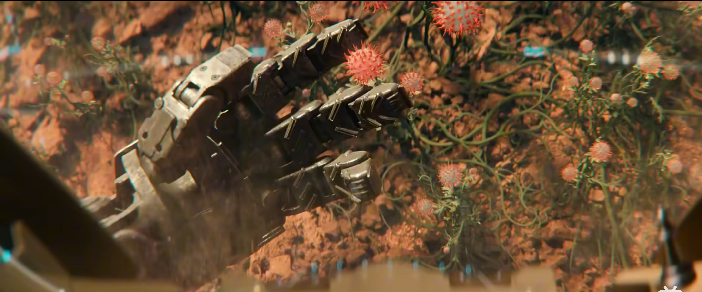

# 假如 AI 蒸馏了我，它能替我表达吗

*公众号：实业+AI+落地｜作者：夜半钟声*

假如 AI 蒸馏了我，它能替我表达吗？

我觉得不能。

不是因为它不够聪明。恰恰相反，它可能很快就能学会我常用的词，知道我在哪些事情上犹豫，甚至替我写出一段“看起来就是我会说的话”。问题是，我自己都不知道下一秒会怎么想。

经历、学历、专业、兴趣、情绪、健康状态，这些东西只能说明此刻的我。它们像一张照片，不是电影。一个电话、一句不经意的话、一晚没睡好，都会把人推到另一个方向。很多决定不是想好了才发生的，是发生了以后才发现：哦，原来我会这么选。

## 一、人很抽象，AI 学不来

“蒸馏”这两个字很准确。它能把我的表达习惯、偏好、判断方式压缩成一个模型。它知道我大概率会怎么回答，却不知道我会不会突然不想回答了。

就像一个和尚反复念“阿弥陀佛”。外人看起来，他一直在重复同一句话。可他的身体在消耗，他可能渴了，可能走神了，可能脑子里正想着很远的事情。重复不等于没变化。人哪怕什么都不做，也在变。

模型只能根据已经留下来的东西猜。它可以有情绪模块，也可以装进机器身体里，能走路、能抓东西、能跟环境互动。但它不饿，不疼，不会在半夜突然觉得自己活得很没劲，也不用为明天的账单、关系和身体负责。

所以我不太会把它当人。它可以是个很好用的机器，但跟宠物也不一样。宠物会饿，会躲你，会在你回家时凑过来。它的身体让这段关系有了重量。AI 没有。

## 二、AI 会犯错，但它替不了我上头

我以前说，AI 不能替人做非理性判断。这句话说得太满了。它当然会犯错，也会给出离谱答案。只是它的错，和人上头以后做的事不是一回事。

人有时候明知道不值，还是会冲出去。比如我本来好好待在家里，突然接到一个电话，可能真的会跑一百公里去公司。路上遇到什么、临时改不改主意、会不会在服务区坐半小时，这些都不在任何记录里。AI 可以帮我把几种可能都算出来，但它替不了我发这个神经。

现实里也是这样。一次招聘、一笔贷款、一场停产、一次放行，最后总得有人拍板。系统可以给建议，可以留痕，可以提醒风险，但后果不会落在模型身上。它也没法替你说“这件事我认了”。

有人把豆包叫作“情绪价值包”。这话不算错。它很会接话，也很会安慰人。可被安慰和有人陪你一起经历，不是一件事。它能把我的几种想法写得都像那么回事，却不知道哪一种会被一通电话、一次争吵或者一个突然冒出来的念头推成现实。

图源：美国国会图书馆，1924 年轴承装配线照片。

## 三、大家躲开的，未必是 AI

我不觉得所有人都讨厌 AI。查资料、改表格、写个脚本、把一堆乱七八糟的东西理清楚，谁不喜欢省事。

人真正不舒服的，是 AI 一进到工业系统里，就开始要求人也像零件一样稳定：可以量化，可以考核，可以预测，可以替换。它进招聘、排班、客服、审核、生产线，不是来帮你写一封邮件，而是在悄悄决定谁更值得留下来，谁应该被催得更紧，谁的申诉不重要。

如果一个模型把故事讲得比我还像我，公司要的会不会只是“我的风格”，而不是我？如果系统已经替我排好了下一步，我还能不能在最后一秒说一句“不干了”？这不是矫情，是人对自己位置的本能保护。

还有一个更现实的问题：出了错，谁来认？平台说模型只是辅助，管理者说自己是照着系统做的，最后挨骂、赔钱、背锅的人，往往离系统最远。人不会因为模型准确率高一点，就把自己的命运交出去。人要先看，自己有没有按停止键的权利。

所以，大家拒绝的不是一个会写字的工具，而是一个不能拒绝、不能解释、不能回退，出了错也找不到人的系统。

## 四、人的别扭，有时候就是刹车

《异星战境》里，Atlas 一开始不相信 AI，连神经连接都抗拒。后来为了活下来，她还是得和机器协作。电影里这很像女主角在拖进度，但我觉得她的抗拒没那么可笑。

你愿不愿意把自己的脑子、身体和判断接进一个系统里，当然应该先别急着点“同意”。谁能看到？谁能关掉？错了算谁的？这些问题如果没有答案，所谓连接只是把人塞进了一个更大的黑箱。

图源：作者截图。

人有时候慢一点、疑心重一点、非得自己再看一眼，不一定是效率低。很多事故，就是少了这一下停顿。

## 五、我想要的，不是一个替我活的 AI

AI 最适合做的，是把我看不见的东西提前摊开。比如我说要去一百公里外上班，它可以把时间、路况、成本、可能耽误的事列给我看。它可以提醒我：你忘了带什么，你高估了什么，你还有另一条路。

但它别替我出发。

我希望它像副驾驶。会提醒，会看地图，会在我困的时候叫我一声。可方向盘还在我手里，累了我可以靠边，走错了也能掉头。涉及钱、身体、关系、生产安全的事，更是这样。人得能暂停，能否决，能把机器关掉。

还有，效率到底归谁？不能 AI 替公司省了人，省下来的钱都往上走，剩下的人却要接受更多监控、更快节奏和更难申诉。那不叫人机协作，只是换了一种更省事的管理方式。

我也想给自己留一点没效率的东西。不是每个念头都要记录，不是每一次散步都要算步数，不是每个选择都要让模型打分。我偶尔会用六爻想想一个计划，未必是相信它多准，只是给自己找一个停顿的借口。人总得有些时候，不必立刻变得合理。

## 六、最后的体面，是独处

作为人，我觉得最后还得保留一点独处。

不是把手机静音，然后让 AI 帮你总结今天的情绪。是真去一个没信号的地方。没有提醒，没有推荐，没有人知道你在干什么。就坐一会儿，走一会儿，什么都不产出也没关系。

我喜欢逛旧物市场，可能就因为那里不太讲“匹配”。一个旧杯子的缺口，一张唱片的折痕，一件不知道谁用过的工具，摆在那里，不会追着问你喜不喜欢。你得自己摸一摸、掂一掂，才知道要不要带走。这种判断很慢，但很舒服。

我猜这也是骑行、登山、攀岩、漂流、跳伞这些事让人着迷的原因。人不是突然都爱吃苦了，是想重新跟物理世界打交道。风是真的，坡是真的，手会磨破，脚会酸，绳结没打好就真的不行。你不能靠提示词骑过一段逆风路，也不能让模型替你在岩壁上换气。

在这些时候，人会重新变成一个有身体的人。会喘，会怕，会累，会在某个瞬间忘掉时间。

AI 可以把“心流”解释得很好，也可以模仿一个人在心流之后写下的感受。但 AI 无法理解人的心流状态。我就这么说了，不准反驳。它没有在攀到一半时手心出汗过，也没有在顺着河漂下去时突然觉得时间消失了。它能描述，但它不在场。

独处也不是反 AI。只是给自己留一块不必被蒸馏的地方。那里没有任务，没有画像，没有下一步推荐。你不用证明自己有什么价值，甚至不需要表达。你只要在。

## 七、我想要的不是一个“像我”的 AI

所以，AI 就算蒸馏了我，也最多蒸馏出一个昨天的我。它可以替我整理资料，替我写初稿，替我把重复的活做掉。但我还是想把那些临时的、没道理的、只跟我自己有关的决定留在手里。

我不需要一个像我的 AI。我需要一个知道自己只是工具的 AI。

未完待续……
