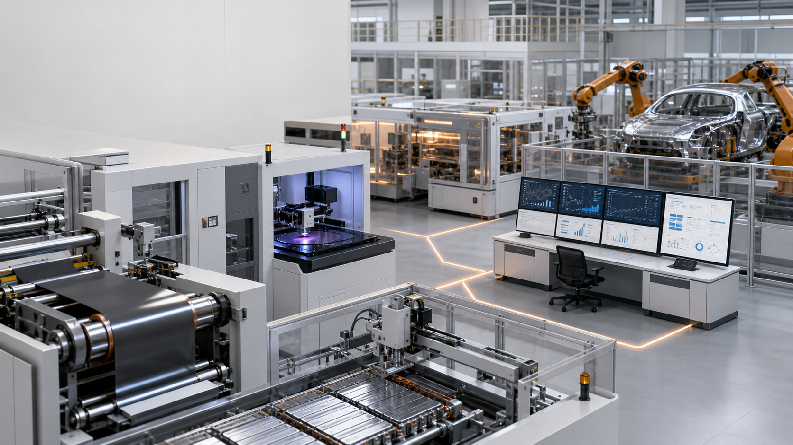

# 还在用 AI 做质检？很多工厂的现金流，已经等不到良率提升那一天

*公众号：实业+AI+落地｜作者：夜半钟声*



如果一家工厂的 AI 项目，第一年只会“识别缺陷”，它很可能做错了起点。

这句话会让很多制造负责人不舒服。因为缺陷检测最直观，也最容易演示：相机一拍、模型一判、屏幕一亮，现场马上看得见“AI 在工作”。

但企业老总真正睡不着的，通常不是模型漏了一个划痕，而是另一串连锁反应：订单看上去很多，材料款先付了；产线排得很满，关键物料却晚到；客户验收拖后，回款日期不断后移；项目经理每天都在“救火”，却没有一张表能告诉他，哪一个延误会先把现金流顶穿。

**良率很重要，但它只是经营结果的一部分。**

真正决定一家实业公司能不能穿越周期的，是能否把市场、订单、排产、供应链、质量、交付和回款放到同一套经营控制体系里。AI 的第一使命，不是替人“看得更清楚”，而是让老板更早知道：**哪笔订单值得接、哪条线该让、哪批料会卡住、哪份应收会延期、哪个项目今天不处理就会变成下季度的亏损。**

## 一、最危险的误区：把“工厂智能化”做成质量部门的孤岛

不少工厂的数字化路径是这样的：先上 MES，再上视觉质检，再接一个大模型问答。每个项目单独看都合理，但它们常常没有回答同一个经营问题。

例如：销售拿下一笔急单，排产系统排进去了，采购发现长周期物料缺口，质量部门为了保交付提高了复检频次，最终产线节拍下降、在制品上升、交付推迟、客户把验收款拖到下个季度。此时即使视觉模型准确率再高，也无法单独修复这条经营链。

老板需要的不是五块各自漂亮的看板，而是一条从“商机”到“现金”的链：

`市场机会 → 报价与订单 → 供应承诺 → 产能与排产 → 制造与质量 → 发货与验收 → 回款与复盘`

这不是要做一个无所不能的“AI 大脑”。恰恰相反，它要求先把每一个决策的边界说清：谁能推荐、谁能审批、谁能执行、出了偏差谁能回退。

## 二、老板真正该盯的，不是一个“工厂大屏”，而是五条风险队列

经营控制的核心不是信息更多，而是让最重要的风险排在最前面。一个可用的 AI 经营驾驶舱，至少应把以下五条队列拉到同一张会议桌上。

### 1. 订单队列：不是“有多少订单”，而是“哪些订单会变成现金”

销售漏斗、合同毛利、客户信用、验收条件、交付承诺和回款条款必须一起看。AI 在这里不该替销售承诺交期，而应提示：

- 该订单的物料、产能、工装和认证前置条件是否齐备；
- 历史上相似客户/相似产品的验收与回款节奏是否偏离合同；
- 紧急插单会挤占哪一批更高贡献或更临近回款的订单；
- 报价中的交期、良率、物流和售后假设是否仍成立。

**一张订单不等于一笔收入；没有被验证的交付承诺，也不等于未来现金。**

### 2. 现金队列：不是财务月底做报表，而是经营每天做选择

现金风险往往在会计报表之前出现：长账期订单增加、预付款采购集中、返工占用加大、发货与验收脱节、库存周转变慢。AI 的价值是把这些信号提前聚合成情景，而非生成一段“财务分析”。

管理层至少要每天看到：未来 4—13 周的预计回款、已承诺采购付款、工资税费等刚性支出、订单交付概率、关键库存占用，以及最坏/基准/最好三种情景。

其中任何预测都必须保留口径：来自合同、客户确认、历史回款、人工调整，还是模型估计。模型估计不能被伪装成确定现金。

### 3. 供应链队列：不是“库存多少”，而是“哪一个缺口会让订单失约”

供应链的关键不只是低库存，而是材料替代、供应商交期、批次质量、在途状态与工艺兼容性的联动。对电池、半导体和复材等行业，来料批次变化会直接传递到质量与交期风险。

AI 可以先做三件实事：识别长周期/单一来源物料；将供应商承诺与实际到货偏差关联到订单；为每条关键物料建立“缺料—替代—验证—批准”的受控流程。它不能绕过质量验证，自动批准材料替换。

### 4. 项目与排产队列：不是“排一张计划”，而是每天找出关键路径

项目延期通常不是因为大家不努力，而是因为关键资源被隐藏在部门边界里：一台测试设备、一个工装、一个可靠性工程师、一次客户见证、一个尚未到货的部件。

AI 适合做约束下的多情景排程：当插单、设备故障或物料延迟发生时，列出不同排法对交期、现金、毛利和客户承诺的影响；同时自动生成待办、责任人和截止日期。最终的排产选择仍必须由业务、制造和财务共同确认。

### 5. 质量与良率队列：让工艺成为经营控制的最后一公里

良率、返工、报废和客诉必须回流到订单毛利、产能占用和现金预测。电池制造的公开研究已指出，规模化质量涉及过程能力、吞吐、微米级公差与多种检验策略；视觉检测能拦截表面问题，却不能取代根因治理。[1](https://www.nature.com/articles/s41467-025-55861-7)


所以，质量 AI 的正确位置是：当经营驾驶舱发现某订单交期或毛利风险上升时，迅速定位是物料、设备、recipe、工艺窗口还是缺陷漏检导致；再把受控的处置结果写回计划与财务情景。质量不是最后的“背锅部门”，而是经营预测的输入变量。

## 三、一条摸得着的主线：从“订单—现金—产能—质量”建立经营闭环

别从买软件开始。先选一个产品族、一类客户和一条现金压力最大的订单链，做出最小闭环：

```text
订单承诺
  ↓
物料/产能/工艺可行性校验
  ↓
排产与任务分解（设备、工装、人员、检验资源）
  ↓
过程质量与异常处置
  ↓
发货、验收、回款预测
  ↓
偏差复盘，更新交期、成本与风险模型
```

这条主线的价值，在于它把“AI 项目”变成了经营项目。第一个成功标准不是模型上线，而是一次风险被提前发现并被正确处置：比如提前两周识别某关键料将缺货，管理层在不牺牲更高优先级订单的情况下调整排程；或识别一批产品因质量风险可能影响验收，提前安排复检与客户沟通，避免回款在月底突然失真。

## 四、五个产业场景：工艺 AI 应怎样接到经营主线里

### 新能源：把材料波动变成订单交付风险，而非事后质量报告

正极、电解液、隔膜、硅碳负极对应的不是四个孤立算法，而是“材料批次—工艺—电芯/产品表现—订单交付”的谱系。正极 SEM 图像的机器学习分类在研究条件下已展示可行性，但不能直接外推为量产收益。[2](https://www.nature.com/articles/s41524-024-01279-6)

首批落地应是：来料与过程异常的风险分流、批次谱系、复检优先级、返工占用对交期的影响。硅基负极等高不确定性材料则更适合放在研发与失效分析加速环节，用数据缩短“异常—假设—复验”的循环，而不是让模型直接决定量产配方。[3](https://www.nature.com/articles/s43246-023-00368-1)

### 钙钛矿：把研发排期变成可计算的实验资产

钙钛矿光伏与 LED 的难点，是配方、制备、薄膜表征、稳定性和规模化之间高度耦合。自动闭环钙钛矿研究显示，机器学习、自动化制备和反馈优化可以在特定研究平台上协同提高重复性。[4](https://www.nature.com/articles/s41586-026-10482-y)

企业可先将配方—工艺—表征—稳定性实验拆为可追溯任务，优先排入信息增益高、占用关键设备少、且能帮助下一轮决策的实验。这里的“研发提效”必须同时看实验轮次、复验率、关键设备等待和从研发样品到可交付样品的周期；不能只看一次模型预测的命中率。

### 半导体：先把量测与失效分析变成经营决策的证据链

光学检测、图像识别、清洁验证、失效分析与工艺参数优化，最怕各自有数据却无法串联。NIST 的计量路线图将缺陷检测、分析、过程控制与良率提升相连，也提醒 AI/ML 正在改变显微与量测技术。[5](https://tsapps.nist.gov/publication/get_pdf.cfm?pub_id=959302)

先做缺陷候选分级、相似案例检索、清洁前后比对和受控 DOE 建议；再把停线、复检、良率损失和客户交付风险带回经营驾驶舱。越接近关键 recipe，越需要人工批准、版本控制和回退机制。

### 商业航天与低空装备：将一次通过率、构型追溯和测试资源纳入排期

这一类产业小批量、多构型、安全约束强，不能只用传统“良率”讲故事。更关键的是一次通过率、测试台与工装占用、构型记录、返修闭环和任务兑现。NASA 相关研究已探索用轮廓扫描与机器学习辅助复材自动铺放缺陷识别，同时保留人工检验员参与判断。[6](https://ntrs.nasa.gov/api/citations/20200002684/downloads/20200002684.pdf)

对管理层来说，AI 的首要任务是找出哪一项装配、测试或供应延误会阻塞关键路径，并输出多个可解释排期情景；它不应替代放行签字或安全责任。

### 黑灯工厂与货物分拣：让“无人”服从于订单兑现与异常恢复

分拣、仓储、线边物流最容易被做成炫技视频，但其经营价值取决于错分/漏分、任务准时率、设备可用率和异常恢复时间。DHL 的公开材料显示，3D 数据与神经网络可用于包裹识别和分拣，同时反光、杂乱堆叠和污损标签仍会显著影响部署效果。[7](https://www.dhl.com/de-en/microsites/csi/computer-vision/logistics-use-cases/shipments.html)

国内一汽-大众天津分公司公开披露过“黑灯物流”实践：室内零件转运投入视觉设备与自主移动机器人，覆盖收货、仓储和上线返空。[8](https://www.teda.gov.cn/contents/858/111230.html) 这说明真实闭环可以运行；但不同工厂的 SKU、场地、WMS/MES 基础与人机协同方式不同，不能照搬其投资回报。

## 五、别把 AI 当“第二套系统”：四步推进，先把会议和责任改掉

### 第一步：30 天，建立一张“经营事实表”

只选一个产品族。将订单、合同条款、客户验收、应收、物料、在制品、设备、质量、发货和责任人用统一 ID 连接。没有这张表，不要谈预测。

### 第二步：30 天，影子运行，不自动控制

让 AI 每天只输出三类风险：可能影响现金的订单、可能影响交付的约束、可能造成返工/报废的质量异常。业务、制造、供应链、财务在同一例会上逐条确认，记录“模型说了什么、团队做了什么、结果发生了什么”。

### 第三步：30 天，把一个动作接入受控闭环

从低风险动作开始：自动创建缺料预警工单、提升复检优先级、提示客户验收风险、给出排产备选方案。价格、付款、供应商替代、关键工艺参数和放行决策必须保留审批权与回退机制。

### 第四步：复制之前，先算清一笔经营账

不要只汇报“模型准确率”。要复盘它是否减少了计划外加班、报废、返工、库存占用、停线或回款延期；同时扣除数据治理、设备改造、复检和运维成本。只有当这笔账能被财务和业务共同确认，才值得复制到第二条线。

## 六、给老板的一张每日问题清单

每天早上，不妨只问团队十个问题：

1. 本周最可能延期的三笔订单，分别会影响多少交付和回款？
2. 哪些订单的合同交期与物料/产能事实已经不一致？
3. 未来 4—13 周的现金情景里，最脆弱的假设是什么？
4. 哪一种缺料、设备或测试资源最可能阻断关键路径？
5. 哪个项目的任务没有明确责任人、截止时间或验收标准？
6. 哪批在制品因质量/返工被占用，何时能释放？
7. 哪个客户验收节点最可能让回款后移？
8. 哪个供应商承诺已经连续偏离，替代与验证计划是什么？
9. 昨天的 AI 预警，有几条被证实、有几条被误报、团队如何处置？
10. 今天最值得管理层亲自消除的一个约束是什么？

如果这十个问题还需要十份 Excel、五个部门和两天时间才能回答，那么问题不在于你有没有 AI，而在于企业还没有一套共同的经营事实。

## 结尾：最该焦虑的，不是“别人有没有上大模型”，而是你是否还在用昨天的方式经营今天的波动

行业下行时，所有人都会谈降本；行业上行时，所有人都会谈扩产。但真正拉开差距的，是谁能在订单变动、供应波动、质量异常和回款延期还没有写进报表之前，就看见它、算清它、调度它。

AI 不会替企业还款，也不会替董事长承担经营责任。可它可以把被部门切碎的事实重新连接起来，把过去靠经验和加班解决的问题，变成可验证、可协同、可回退的经营动作。

**如果你的 AI 还只在抓缺陷，而没有开始管理订单兑现与现金风险，那么它离真正的“落地”，可能还很远。**

---

## 发布前检查

- 标题已采用争议性表达，但未使用未经验证的行业倒闭、融资或回款数据。
- 将“AI 预测”与“合同事实、人工确认、审批决策”明确区分。
- 对科研、官方与企业案例均保留适用边界；不得将特定研究或单厂案例写成行业普遍 ROI。
- 发布前请补充本企业/客户案例时的授权、合同保密边界与内部数据口径。
